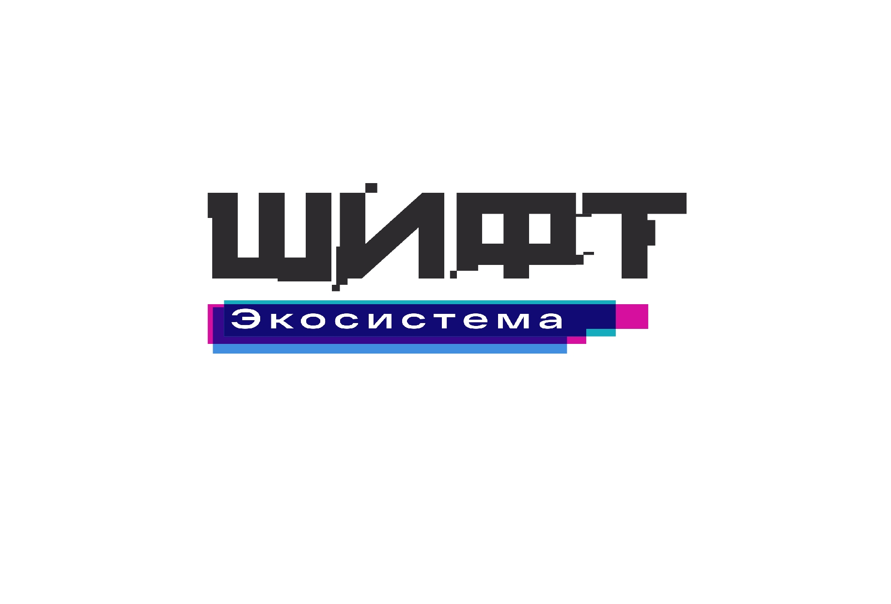

<p align="center">
  
</p>

# Интенсив ШИФТ — Практические задания

Репозиторий для выполнения домашних работ и практических заданий в рамках интенсива ШИФТ.  
Все проекты реализованы на **TypeScript**.

## Навигация по заданиям

* 📁 **[Задание № 1: Скриншот-тесты](./task-1-screenshot-tests)** — Автоматизация визуального тестирования интерфейсов (Playwright + TypeScript).

---

## 📋 Задание № 1: Скриншот-тестирование

В этом модуле разрабатываются скриншот-тесты (Visual Regression Testing) для проверки веб-интерфейсов.

### 🛠️ Стек технологий
* **Фреймворк:** Playwright
* **Язык:** TypeScript

### 🚀 Локальный запуск и команды

⚠️ Перед запуском убедитесь, что вы находитесь в папке задания (`cd task-1-screenshot-tests`) 
    и установили зависимости (`npm install`).

#### Основные команды Playwright:

* 🏃 **Запуск всех тестов:**
  ```bash
  npx playwright test
  ```
* 🖥️ **Запуск тестов в режиме интерфейса (UI mode):**
  ```bash
  npx playwright test --ui
  ```
* 📸 **Обновление эталонных скриншотов:**
  ```bash
  npx playwright test --update-snapshots
  ```
* 📊 **Просмотр отчета об ошибках:**
  ```bash
  npx playwright show-report
  ```

---

## 💻 Как запустить любое задание локально

1. Клонируйте репозиторий:
   ```bash
   git clone https://github.com/selenadanilova-ux/shift-aqa-web
   ```
2. Перейдите в папку нужного задания:
   ```bash
   cd shift-aqa-web/task-1-screenshot-tests
   ```
3. Установите зависимости и запустите код по инструкции внутри папки задания:
   ```bash
   npm install
   ```
